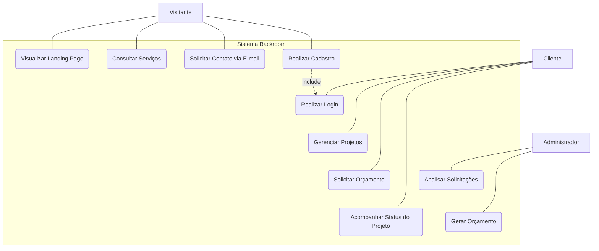

# Diagrama de Caso de Uso Web

- A seguir diagrama demonstra como um visitante, um cliente/usuário e como um administrador interagem com o sistema web de assistência.

### Atores
- **Visitante**: Um não cliente interessado nos serviços da Backroom
- **Cliente/Usuário**: Alguém com cadastro no sistema 
- **Administrador**: Resposta de dúvidas sobre os serviços



# Casos de Uso Desktop

```Mermaid
graph TD
    Funcionario
    Administrador

    subgraph "Sistema de Chamados Desktop"
        UC1("Solicitar abertura de chamado")
        UC2("Responder chamado")
        UC3("Visualizar chamados")
        UC4("Aceitar solicitação de chamado")
        UC5("Criar novo chamado")
        UC6("Marcar chamado como concluído")
        UC7("Deletar chamado")
        
        %% Verticalização via links invisíveis
        UC2 ~~~ UC3
        UC4 ~~~ UC5
        UC5 ~~~ UC6
        UC6 ~~~ UC7
    end

    %% Relacionamentos Visíveis
    Funcionario --- UC1
    Funcionario --- UC2
    Funcionario --- UC3

    Administrador --- UC4
    Administrador --- UC5
    Administrador --- UC6
    Administrador --- UC7
    Administrador --- UC3

    UC1 -.->|include| UC3
    UC2 -.->|include| UC3
    UC4 -.->|include| UC3
    UC5 -.->|include| UC3
    UC6 -.->|include| UC3
```

# Casos de Uso Web
