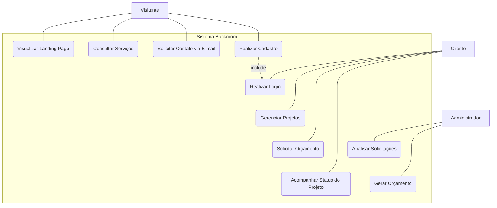
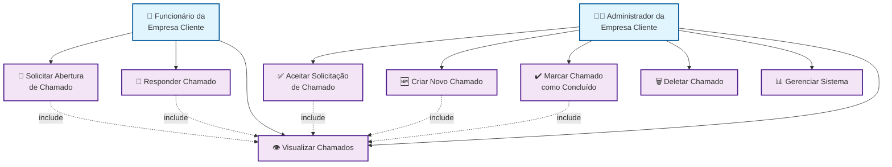

# Diagrama de Caso de Uso Web

- A seguir diagrama demonstra como um visitante, um cliente/usuário e como um administrador interagem com o sistema web de assistência.

### Atores
- **Visitante**: Um não cliente interessado nos serviços da Backroom
- **Cliente/Usuário**: Alguém com cadastro no sistema 
- **Administrador**: Resposta de dúvidas sobre os serviços

# Casos de Uso Desktop

# Casos de Uso Web
