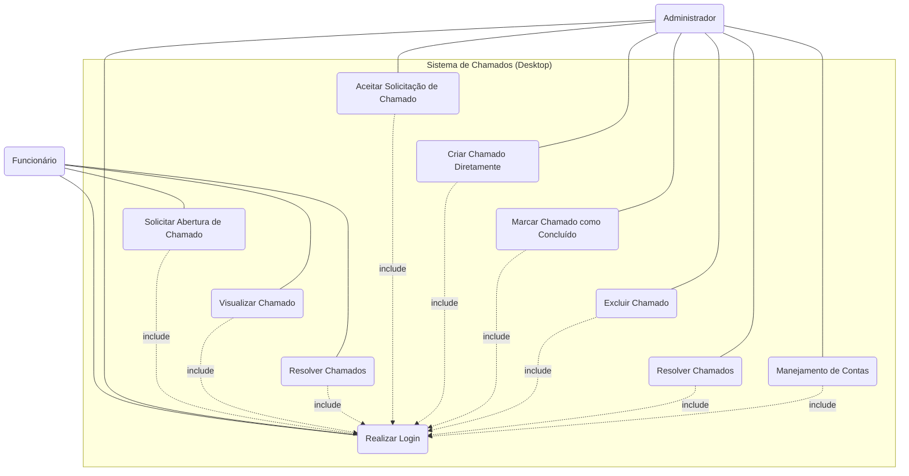
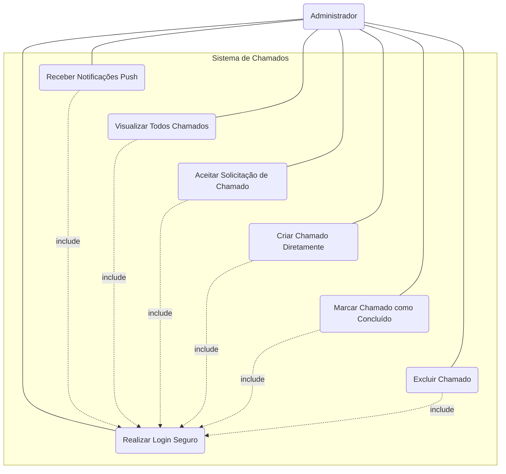

# Diagrama de Caso de Uso Web - Padrão

- A seguir um diagrama que demonstra como um visitante, um cliente/usuário e como um administrador interagem com o sistema web de assistência.

### Atores
- **Visitante**: Um não cliente interessado nos serviços da Backroom
- **Cliente/Usuário**: Alguém com cadastro no sistema 
- **Administrador**: Resposta de dúvidas sobre os serviços

# Diagrama de Casos de Uso Desktop - Exemplo

- A seguir um Diagrama que demonstra como Funcionário e Administrador iriam reagir em um sistema modular backroom criado para a resolução de chamados da empresa cliente.

### Atores
- **Funcionários**: Respondem a chamados e solicitam novos
- **Administradores**: Manejam o sistema.

# Diagrama de Casos de Uso Mobile - Gerenciamento

- A seguir um Diagrama que demonstra como O Administrador iria ter acesso ao sistema desktop pelo celular, garantindo mobilidade caso ele seja um gestor de diversas empresas.

### Atores
- **Administrador**: O app mobile, sendo exclusivo para administradores garante Gerenciamento à distância

