# Diagrama de Caso de Uso Web

- A seguir diagrama demonstra como um visitante, um cliente/usuário e como um administrador interagem com o sistema web de assistência.

### Atores
- **Visitante**: Um não cliente interessado nos serviços da Backroom
- **Cliente/Usuário**: Alguém com cadastro no sistema 
- **Administrador**: Resposta de dúvidas sobre os serviços

```mermaid
graph TD
    Visitante
    Cliente
    Administrador

    subgraph "Sistema Backroom"
        UC1("Visualizar Landing Page")
        UC2("Consultar Serviços")
        UC3("Solicitar Contato via E-mail")
        UC4("Realizar Cadastro")
        UC5("Realizar Login")
        UC6("Gerenciar Projetos")
        UC7("Solicitar Orçamento")
        UC8("Acompanhar Status do Projeto")
        UC9("Analisar Solicitações")
        UC10("Gerar Orçamento")

        %% Links Invisíveis para forçar a verticalização
        UC5 ~~~ UC6
        UC6 ~~~ UC7
        UC7 ~~~ UC8

        UC9 ~~~ UC10
    end

    %% Relacionamentos Visíveis
    Visitante --- UC1
    Visitante --- UC2
    Visitante --- UC3
    Visitante --- UC4
    
    Cliente --- UC5
    Cliente --- UC6
    Cliente --- UC7
    Cliente --- UC8
    
    Administrador --- UC9
    Administrador --- UC10
    
    UC4 -.->|include| UC5
```

# Casos de Uso Desktop

```mermaid
graph TD
    %% Atores
    F["👤 Funcionário da<br/>Empresa Cliente"]
    A["👨‍💼 Administrador da<br/>Empresa Cliente"]
    
    %% Casos de Uso do Funcionário
    UC1["📝 Solicitar Abertura<br/>de Chamado"]
    UC2["💬 Responder Chamado"]
    UC3["👁️ Visualizar Chamados"]
    
    %% Casos de Uso do Administrador
    UC4["✅ Aceitar Solicitação<br/>de Chamado"]
    UC5["🆕 Criar Novo Chamado"]
    UC6["✔️ Marcar Chamado<br/>como Concluído"]
    UC7["🗑️ Deletar Chamado"]
    UC8["📊 Gerenciar Sistema"]
    
    %% Relacionamentos do Funcionário
    F --> UC1
    F --> UC2
    F --> UC3
    
    %% Relacionamentos do Administrador  
    A --> UC4
    A --> UC5
    A --> UC6
    A --> UC7
    A --> UC8
    A --> UC3
    
    %% Relacionamentos Include/Extend
    UC1 -.->|include| UC3
    UC2 -.->|include| UC3
    UC4 -.->|include| UC3
    UC5 -.->|include| UC3
    UC6 -.->|include| UC3
    
    %% Estilo dos elementos
    classDef actor fill:#e1f5fe,stroke:#01579b,stroke-width:2px
    classDef usecase fill:#f3e5f5,stroke:#4a148c,stroke-width:2px
    classDef system fill:#e8f5e8,stroke:#2e7d32,stroke-width:2px
    
    class F,A actor
    class UC1,UC2,UC3,UC4,UC5,UC6,UC7,UC8 usecase
```

# Casos de Uso Web
