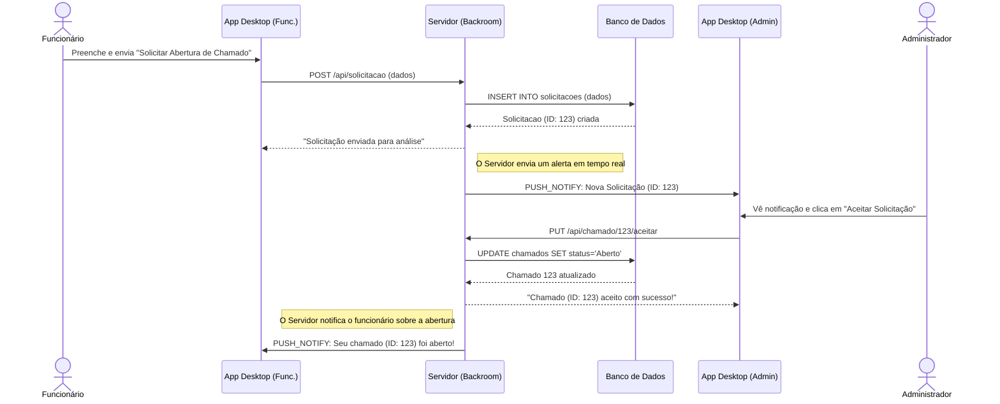
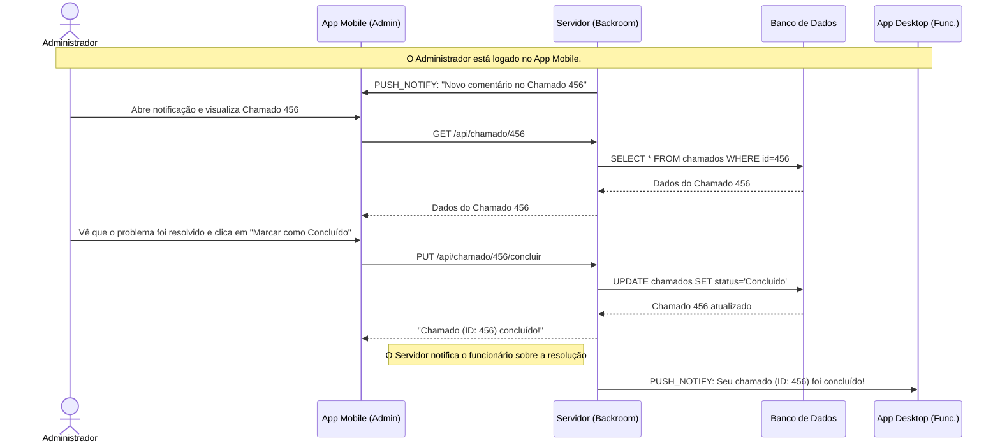

# Diagrama de Sequência Desktop - Exemplo

```mermaid
sequenceDiagram
    actor Func as Funcionário
    participant AppFunc as App Desktop (Func.)
    participant Servidor as Servidor (Backroom)
    participant BD as Banco de Dados
    participant AppAdmin as App Desktop (Admin)
    actor Admin as Administrador

    Func->>AppFunc: Preenche e envia "Solicitar Abertura de Chamado"
    AppFunc->>Servidor: POST /api/solicitacao (dados)
    
    Servidor->>BD: INSERT INTO solicitacoes (dados)
    BD-->>Servidor: Solicitacao (ID: 123) criada
    
    Servidor-->>AppFunc: "Solicitação enviada para análise"
    
    note right of Servidor: O Servidor envia um alerta em tempo real
    Servidor->>AppAdmin: PUSH_NOTIFY: Nova Solicitação (ID: 123)
    
    Admin->>AppAdmin: Vê notificação e clica em "Aceitar Solicitação"
    AppAdmin->>Servidor: PUT /api/chamado/123/aceitar
    
    Servidor->>BD: UPDATE chamados SET status='Aberto'
    BD-->>Servidor: Chamado 123 atualizado
    
    Servidor-->>AppAdmin: "Chamado (ID: 123) aceito com sucesso!"
    
    note left of Servidor: O Servidor notifica o funcionário sobre a abertura
    Servidor->>AppFunc: PUSH_NOTIFY: Seu chamado (ID: 123) foi aberto!
```

# Diagrama de Sequência Mobile - Gerenciamento

```mermaid
sequenceDiagram
    actor Admin as Administrador
    participant AppMobile as App Mobile (Admin)
    participant Servidor as Servidor (Backroom)
    participant BD as Banco de Dados
    participant AppFunc as App Desktop (Func.)

    note over Admin, AppFunc: O Administrador está logado no App Mobile.
    
    Servidor->>AppMobile: PUSH_NOTIFY: "Novo comentário no Chamado 456"
    
    Admin->>AppMobile: Abre notificação e visualiza Chamado 456
    AppMobile->>Servidor: GET /api/chamado/456
    Servidor->>BD: SELECT * FROM chamados WHERE id=456
    BD-->>Servidor: Dados do Chamado 456
    Servidor-->>AppMobile: Dados do Chamado 456
    
    Admin->>AppMobile: Vê que o problema foi resolvido e clica em "Marcar como Concluído"
    AppMobile->>Servidor: PUT /api/chamado/456/concluir
    
    Servidor->>BD: UPDATE chamados SET status='Concluido'
    BD-->>Servidor: Chamado 456 atualizado
    
    Servidor-->>AppMobile: "Chamado (ID: 456) concluído!"
    
    note left of Servidor: O Servidor notifica o funcionário sobre a resolução
    Servidor->>AppFunc: PUSH_NOTIFY: Seu chamado (ID: 456) foi concluído!
```
