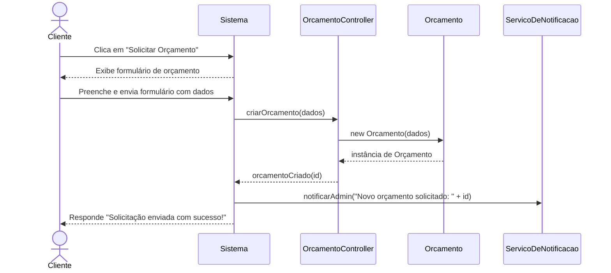

###Diagrama de Sequência

```mermaid
sequenceDiagram
    actor C as Cliente
    participant S as Sistema
    participant OC as OrcamentoController
    participant O as Orcamento
    participant N as ServicoDeNotificacao

    C->>S: Clica em "Solicitar Orçamento"
    S-->>C: Exibe formulário de orçamento
    
    C->>S: Preenche e envia formulário com dados
    S->>OC: criarOrcamento(dados)
    
    OC->>O: new Orcamento(dados)
    O-->>OC: instância de Orçamento
    
    OC-->>S: orcamentoCriado(id)
    S->>N: notificarAdmin("Novo orçamento solicitado: " + id)
    
    S-->>C: Responde "Solicitação enviada com sucesso!"
```
