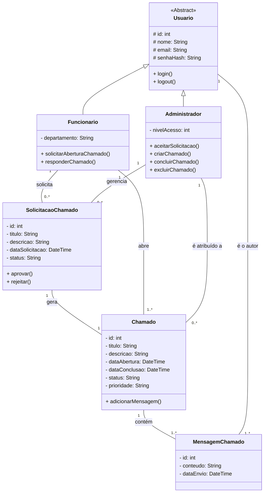
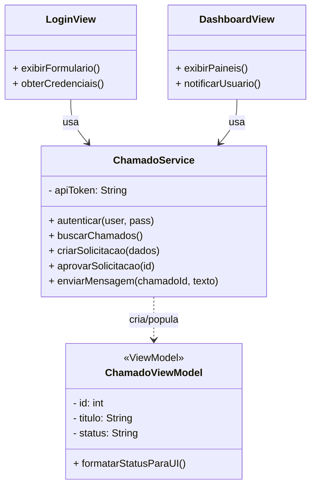
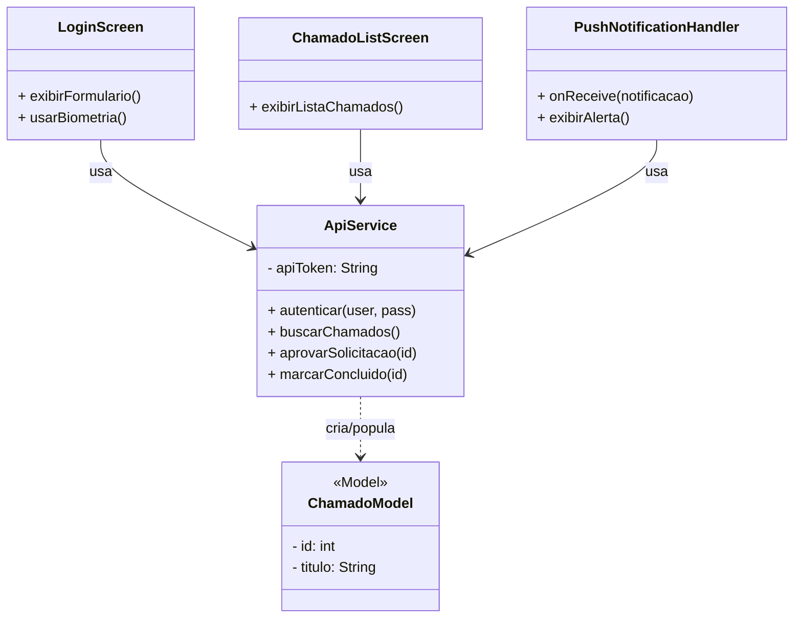

# Diagrama de Classes Backend - Desktop

```mermaid
classDiagram
    direction TB

    class Usuario {
        <<Abstract>>
        # id: int
        # nome: String
        # email: String
        # senhaHash: String
        + login()
        + logout()
    }

    class Funcionario {
        - departamento: String
        + solicitarAberturaChamado()
        + responderChamado()
    }

    class Administrador {
        - nivelAcesso: int
        + aceitarSolicitacao()
        + criarChamado()
        + concluirChamado()
        + excluirChamado()
    }

    class SolicitacaoChamado {
        - id: int
        - titulo: String
        - descricao: String
        - dataSolicitacao: DateTime
        - status: String
        + aprovar()
        + rejeitar()
    }

    class Chamado {
        - id: int
        - titulo: String
        - descricao: String
        - dataAbertura: DateTime
        - dataConclusao: DateTime
        - status: String
        - prioridade: String
        + adicionarMensagem()
    }
    
    class MensagemChamado {
        - id: int
        - conteudo: String
        - dataEnvio: DateTime
    }

    %% Herança
    Usuario <|-- Funcionario
    Usuario <|-- Administrador

    %% Relacionamentos
    Funcionario "1" -- "0..*" SolicitacaoChamado : solicita
    Administrador "1" -- "0..*" SolicitacaoChamado : gerencia
    
    SolicitacaoChamado "1" -- "1" Chamado : gera
    
    Funcionario "1" -- "1..*" Chamado : abre
    Administrador "1" -- "0..*" Chamado : é atribuído a
    
    Chamado "1" -- "1..*" MensagemChamado : contém
    Usuario "1" -- "1..*" MensagemChamado : é o autor
```

### Diagrama de Classes Desktop - Client-side

```mermaid
classDiagram
    direction TB

    class LoginView {
        + exibirFormulario()
        + obterCredenciais()
    }
    
    class DashboardView {
        + exibirPaineis()
        + notificarUsuario()
    }

    class ChamadoService {
        - apiToken: String
        + autenticar(user, pass)
        + buscarChamados()
        + criarSolicitacao(dados)
        + aprovarSolicitacao(id)
        + enviarMensagem(chamadoId, texto)
    }

    class ChamadoViewModel {
        <<ViewModel>>
        - id: int
        - titulo: String
        - status: String
        + formatarStatusParaUI()
    }

    LoginView --> ChamadoService : usa
    DashboardView --> ChamadoService : usa
    ChamadoService ..> ChamadoViewModel : cria/popula
```

### Diagrama de Classes Mobile - Client-Side

```mermaid
classDiagram
    direction TB

    class LoginScreen {
        + exibirFormulario()
        + usarBiometria()
    }

    class ChamadoListScreen {
        + exibirListaChamados()
    }
    
    class PushNotificationHandler {
        + onReceive(notificacao)
        + exibirAlerta()
    }

    class ApiService {
        - apiToken: String
        + autenticar(user, pass)
        + buscarChamados()
        + aprovarSolicitacao(id)
        + marcarConcluido(id)
    }

    class ChamadoModel {
        <<Model>>
        - id: int
        - titulo: String
    }

    LoginScreen --> ApiService : usa
    ChamadoListScreen --> ApiService : usa
    PushNotificationHandler --> ApiService : usa
    ApiService ..> ChamadoModel : cria/popula
```
