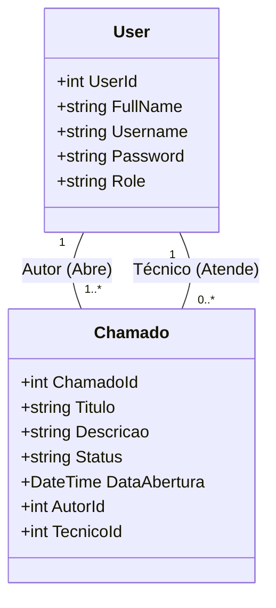
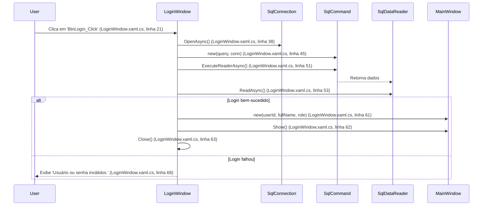
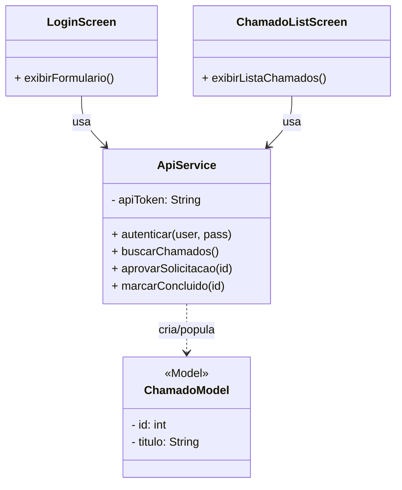

# Diagrama de Classes (Entidades Principais)

```mermaid
classDiagram
    class User {
        +int UserId
        +string FullName
        +string Username
        +string Password
        +string Role
    }

    class Chamado {
        +int ChamadoId
        +string Titulo
        +string Descricao
        +string Status
        +DateTime DataAbertura
        +int AutorId
        +int TecnicoId
    }

    User "1" -- "1..*" Chamado : Autor (Abre)
    User "1" -- "0..*" Chamado : Técnico (Atende)
```

# Diagrama de Classes Desktop - Client-side

```mermaid
sequenceDiagram
    participant User
    participant LoginWindow
    participant SqlConnection
    participant SqlCommand
    participant SqlDataReader
    participant MainWindow

    User->>LoginWindow: Clica em 'BtnLogin_Click' (LoginWindow.xaml.cs, linha 21)
    LoginWindow->>SqlConnection: OpenAsync() (LoginWindow.xaml.cs, linha 38)
    LoginWindow->>SqlCommand: new(query, conn) (LoginWindow.xaml.cs, linha 45)
    LoginWindow->>SqlCommand: ExecuteReaderAsync() (LoginWindow.xaml.cs, linha 51)
    SqlCommand-->>SqlDataReader: Retorna dados
    LoginWindow->>SqlDataReader: ReadAsync() (LoginWindow.xaml.cs, linha 53)
    alt Login bem-sucedido
        LoginWindow->>MainWindow: new(userId, fullName, role) (LoginWindow.xaml.cs, linha 61)
        LoginWindow->>MainWindow: Show() (LoginWindow.xaml.cs, linha 62)
        LoginWindow->>LoginWindow: Close() (LoginWindow.xaml.cs, linha 63)
    else Login falhou
        LoginWindow-->>User: Exibe 'Usuário ou senha inválidos.' (LoginWindow.xaml.cs, linha 68)
    end
```

# Diagrama de Classes (Implementação e Dependências)

```mermaid
classDiagram
    direction TB

    class LoginScreen {
        + exibirFormulario()
    }

    class ChamadoListScreen {
        + exibirListaChamados()
    }

    class ApiService {
        - apiToken: String
        + autenticar(user, pass)
        + buscarChamados()
        + aprovarSolicitacao(id)
        + marcarConcluido(id)
    }

    class ChamadoModel {
        <<Model>>
        - id: int
        - titulo: String
    }

    LoginScreen --> ApiService : usa
    ChamadoListScreen --> ApiService : usa
    ApiService ..> ChamadoModel : cria/popula
```
