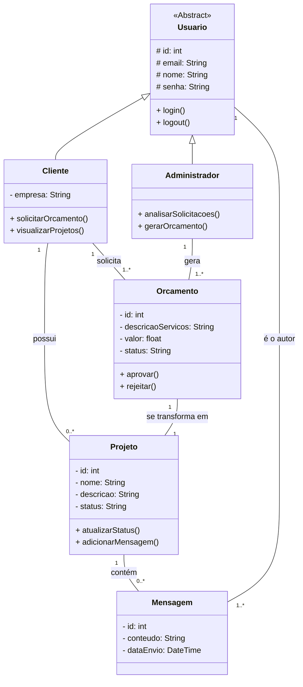

### Diagrama de Classes

```mermaid
classDiagram
    direction TB

    class Usuario {
        <<Abstract>>
        # id: int
        # email: String
        # nome: String
        # senha: String
        + login()
        + logout()
    }

    class Cliente {
        - empresa: String
        + solicitarOrcamento()
        + visualizarProjetos()
    }

    class Administrador {
        + analisarSolicitacoes()
        + gerarOrcamento()
    }

    class Projeto {
        - id: int
        - nome: String
        - descricao: String
        - status: String
        + atualizarStatus()
        + adicionarMensagem()
    }

    class Orcamento {
        - id: int
        - descricaoServicos: String
        - valor: float
        - status: String
        + aprovar()
        + rejeitar()
    }

    class Mensagem {
        - id: int
        - conteudo: String
        - dataEnvio: DateTime
    }

    Usuario <|-- Cliente
    Usuario <|-- Administrador

    Cliente "1" -- "0..*" Projeto : possui
    Cliente "1" -- "1..*" Orcamento : solicita
    Administrador "1" -- "1..*" Orcamento : gera
    Orcamento "1" -- "1" Projeto : se transforma em
    Projeto "1" -- "0..*" Mensagem : contém
    Usuario "1" -- "1..*" Mensagem : é o autor
```
