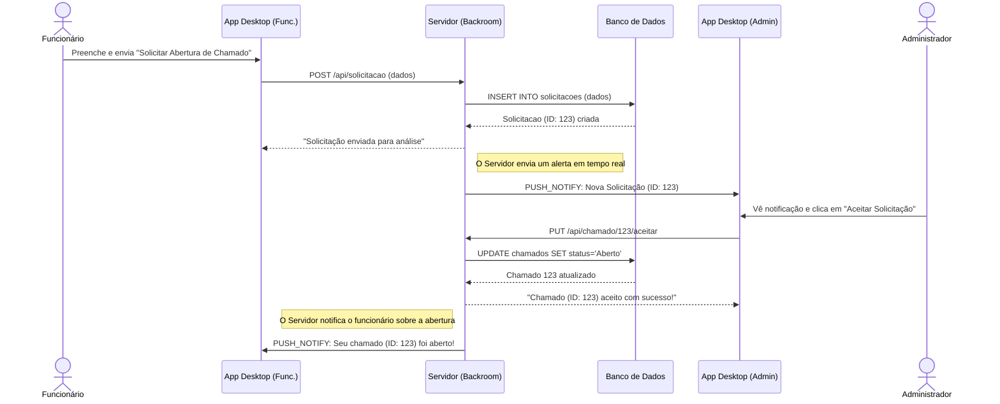

### Diagrama de Sequência Desktop - Exemplo

```mermaid
sequenceDiagram
    actor Func as Funcionário
    participant AppFunc as App Desktop (Func.)
    participant Servidor as Servidor (Backroom)
    participant BD as Banco de Dados
    participant AppAdmin as App Desktop (Admin)
    actor Admin as Administrador

    Func->>AppFunc: Preenche e envia "Solicitar Abertura de Chamado"
    AppFunc->>Servidor: POST /api/solicitacao (dados)
    
    Servidor->>BD: INSERT INTO solicitacoes (dados)
    BD-->>Servidor: Solicitacao (ID: 123) criada
    
    Servidor-->>AppFunc: "Solicitação enviada para análise"
    
    note right of Servidor: O Servidor envia um alerta em tempo real
    Servidor->>AppAdmin: PUSH_NOTIFY: Nova Solicitação (ID: 123)
    
    Admin->>AppAdmin: Vê notificação e clica em "Aceitar Solicitação"
    AppAdmin->>Servidor: PUT /api/chamado/123/aceitar
    
    Servidor->>BD: UPDATE chamados SET status='Aberto'
    BD-->>Servidor: Chamado 123 atualizado
    
    Servidor-->>AppAdmin: "Chamado (ID: 123) aceito com sucesso!"
    
    note left of Servidor: O Servidor notifica o funcionário sobre a abertura
    Servidor->>AppFunc: PUSH_NOTIFY: Seu chamado (ID: 123) foi aberto!
```
