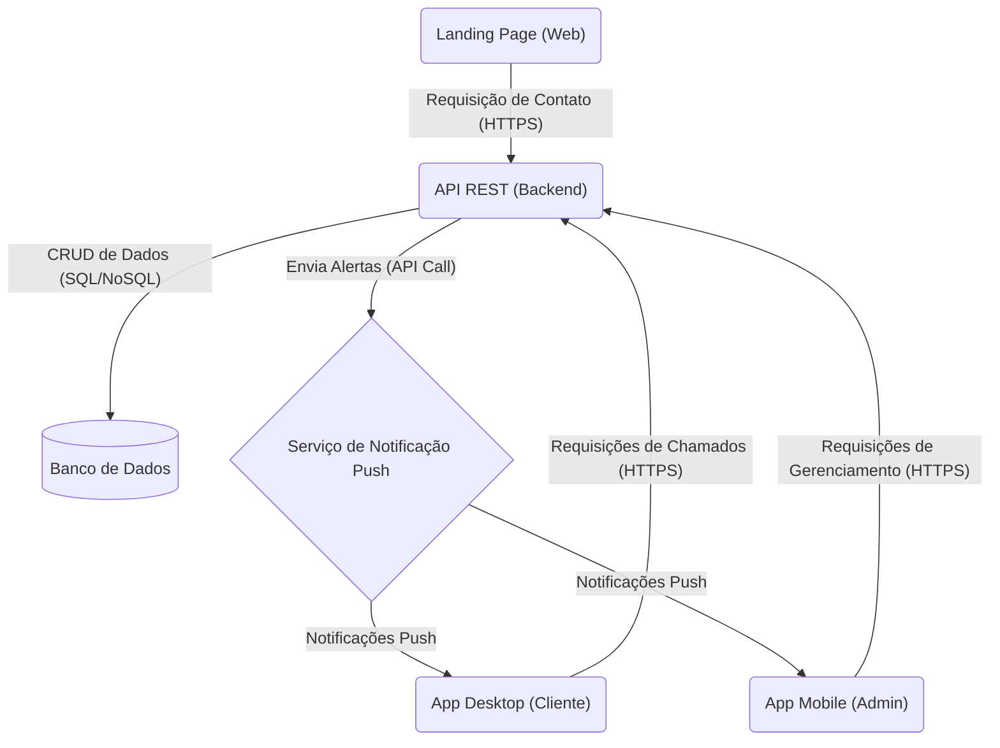

# Diagrama de Componentes

```mermaid
graph TD
    %% Componentes Principais
    LP("Landing Page (Web)")
    AD("App Desktop (Cliente)")
    AM("App Mobile (Admin)")
    API("API REST (Backend)")
    DB[(Banco de Dados)]
    SNP{"Serviço de Notificação Push"}

    %% Conexões e Interfaces
    
    %% Landing Page -> API (para futuras interações, ex: formulário de contato avançado)
    LP -- "Requisição de Contato (HTTPS)" --> API
    
    %% Apps -> API (comunicação principal)
    AD -- "Requisições de Chamados (HTTPS)" --> API
    AM -- "Requisições de Gerenciamento (HTTPS)" --> API
    
    %% API -> Banco de Dados (persistencia de dados)
    API -- "CRUD de Dados (SQL/NoSQL)" --> DB
    
    %% API -> Serviço de Notificação Push (enviar alertas)
    API -- "Envia Alertas (API Call)" --> SNP

    %% Serviço de Notificação Push -> Apps (recebimento de alertas)
    SNP -- "Notificações Push" --> AD
    SNP -- "Notificações Push" --> AM
```
