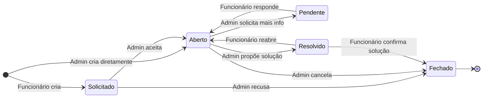

# Diagrama de Máquina de estados - Ciclo de Vida do Chamado

```mermaid
stateDiagram-v2
    direction LR
    
    [*] --> Solicitado : Funcionário cria
    [*] --> Aberto : Admin cria diretamente

    Solicitado --> Aberto : Admin aceita
    Solicitado --> Fechado : Admin recusa

    Aberto --> Pendente : Admin solicita mais info
    Aberto --> Resolvido : Admin propõe solução
    Aberto --> Fechado : Admin cancela
    
    Pendente --> Aberto : Funcionário responde

    Resolvido --> Aberto : Funcionário reabre
    Resolvido --> Fechado : Funcionário confirma solução
    
    Fechado --> [*]
```
