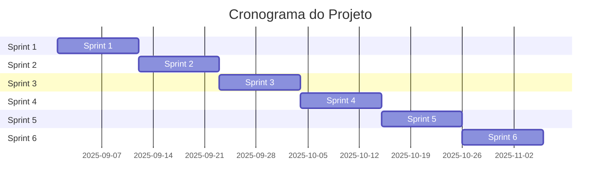

# ⏲ Backroom

<div align="center">
  
  
  ### Organizando o seu tempo
  
  
  
</div> 

---

## 📑 Índice

| [Empresa](#backroom) | [Equipe](#-Equipe) | [Backlog](#backlog-do-produto) | [Cronograma](#-cronograma-das-sprints) | [Sprints](#tabela-descritiva-das-sprints) | [Tecnologias](#tecnologias-utilizadas) | [Estrutura](#estrutura-do-projeto) | [Documentação](#link-para-documentação) | [Contato](#-Contato) |

---

## Descrição do Desafio

Este é um projeto PIM onde criamos uma empresa fictícia para treinarmos nossa especialização para padronização de: Documentação, Propaganda própria, Gráficos...

## Backroom
### Sua empresa, seu sistema, sua identidade

Transforme a gestão da sua empresa com soluções sob medida
Na Backroom, acreditamos que cada empresa é única e merece um sistema de gestão que reflita exatamente suas necessidades. Chega de se adaptar a softwares genéricos que não conversam com sua realidade!

## Por que escolher a Backroom?
 - 🎯 Programas 100% Customizáveis
Desenvolvemos sistemas de gestão local personalizados, focados em interfaces intuitivas e experiência do usuário excepcional. Cada funcionalidade é pensada especificamente para o seu negócio.
 - 💻 Foco no Front-end
Interface moderna, responsiva e fácil de usar. Seus colaboradores vão amar trabalhar com um sistema feito para eles. 
 - 🛠️ Suporte Técnico Especializado
Com nossa assinatura, você tem acesso direto à nossa equipe técnica experiente. Suporte contínuo, atualizações e melhorias constantes para garantir que seu sistema evolua junto com sua empresa.
 - 🏢 Gestão Local Completa
Mantenha o controle total dos seus dados com sistemas que rodam na sua própria infraestrutura, garantindo segurança e autonomia.

## Como funciona?

  Análise das suas necessidades - Além da necessidade, enxergamos o humano, com profissionais treinados os seus desejos facilmente se tornarão código.
  Desenvolvimento personalizado - A partir de seus requisitos desenvolvemos o seu software personalizado.
  Implementação e treinamento - Com profissionais treinados em comunicação, a sua empresa será ensinada a ter autonomia sobre seu programa.
  Suporte contínuo - Caso deseje suporte direto por tempo indeterminado, oferecemos assinaturas para o suporte especializado.

  ---

  ## 👥 Equipe

<div align="center">
  <table>
    <tr>
      <td align="center"><br /><b>[Pedro H.P. Cordeiro]</b><br /><i>Project Owner</i></td>
      <td align="center"><br /><b>[Cordeiro H.P. Perrenchelle]</b><br /><i>Cientista de Dados</i></td>
      <td align="center"><br /><b>[Henrique Pedro P.C.]</b><br /><i>UX/UI Designer</i></td>
      <td align="center"><br /><b>[Perrenchelle C.H. Pedro]</b><br /><i>Desenvolvedor Pricipal</i></td>
      <td align="center"><br /><b>[Henrique P.C. Perrenchelle]</b><br /><i>Scrum Master</i></td>
    </tr>
  </table>
</div>

---

## Backlog do Produto

- [✔️] [**Epic do cliente**](https://github.com/CordeiroGente/Backroom/blob/main/Backlog.md) 

---

## ⏰ Cronograma das Sprints



---

### Tabela Descritiva das Sprints

Esta tabela atualizada resume os 6 Sprints, seus períodos corretos, os objetivos focais que definimos, e o status de "Concluído".

```markdown
## Tabela Descritiva das Sprints

| Sprint | Período | Objetivo | Status |
|--------|---------|----------|--------|
| **Sprint 1** | 01/09 - 11/09 | Fundação e Autenticação (Web) | Concluído ✅ |
| **Sprint 2** | 12/09 - 22/09 | Lógica de Negócios (Web) | Concluído ✅ |
| **Sprint 3** | 23/09 - 03/10 | MVP Help Desk (Funcionário) | Concluído ✅ |
| **Sprint 4** | 04/10 - 14/10 | MVP Gerenciamento (Desktop + Mobile) | Concluído ✅ |
| **Sprint 5** | 15/10 - 25/10 | Fluxos Avançados (Should-Haves) | Concluído ✅ |
| **Sprint 6** | 26/10 - 05/11 | Melhorias e Relatórios (Could-Haves) | Concluído ✅ |
```

## Link para Documentação da Sprint

- [📋 Sprint 1 - Documentação](https://github.com/CordeiroGente/Backroom/blob/main/Documenta%C3%A7%C3%A3o/Sprints/Sprint%201.md)
- [📋 Sprint 2 - Documentação](https://github.com/CordeiroGente/Backroom/blob/main/Documenta%C3%A7%C3%A3o/Sprints/sprint%202.md)
- [📋 Sprint 3 - Documentação](https://github.com/CordeiroGente/Backroom/blob/main/Documenta%C3%A7%C3%A3o/Sprints/sprint%203.md)
- [📋 Sprint 4 - Documentação](https://github.com/CordeiroGente/Backroom/blob/main/Documenta%C3%A7%C3%A3o/Sprints/sprint%204.md)
- [📋 Sprint 5 - Documentação](https://github.com/CordeiroGente/Backroom/blob/main/Documenta%C3%A7%C3%A3o/Sprints/sprint%205.md)
- [📋 Sprint 6 - Documentação](https://github.com/CordeiroGente/Backroom/blob/main/Documenta%C3%A7%C3%A3o/Sprints/sprint%206.md)

---

## Tecnologias Utilizadas

### Documentação
- [README.md]
- [Mermaid]


### Frontend
- [Framework/Biblioteca] - v[X.X.X]
- [Tecnologia 2] - v[X.X.X]

### Backend
- [Linguagem/Framework] - C# v[X.X.X]
- [Tecnologia 2] - v[X.X.X]

### Banco de Dados
- [Sistema de BD] - v[X.X.X]

### DevOps/Ferramentas
- [Ferramenta 1] - v[X.X.X]
- [Ferramenta 2] - v[X.X.X]

---

## Estrutura do Projeto

```
Backroom/
│
├── Documentação
│   ├── Backlog.md
│   ├── Diagramas
│   │   ├── Casos De Uso.md
│   │   ├── Diagrama de Classe.md
│   │   └── Diagrama de Sequência.md
│   └── Sprints
│       ├── Sprint 1.md
│       ├── sprint 2.md
│       ├── sprint 3.md
│       ├── sprint 4.md
│       ├── sprint 5.md
│       └── sprint 6.md
│
└── README.md
```

---

## Diagramas

📚 [**Diagramas**](https://github.com/CordeiroGente/Backroom/tree/main/Documenta%C3%A7%C3%A3o/Diagramas)

---

## 📞 Contato

- Email: BackroomA@gmail.com
- Website: [www.Backroom.com.br](ex)
- Instagram: [@Backroom](ex)

---
