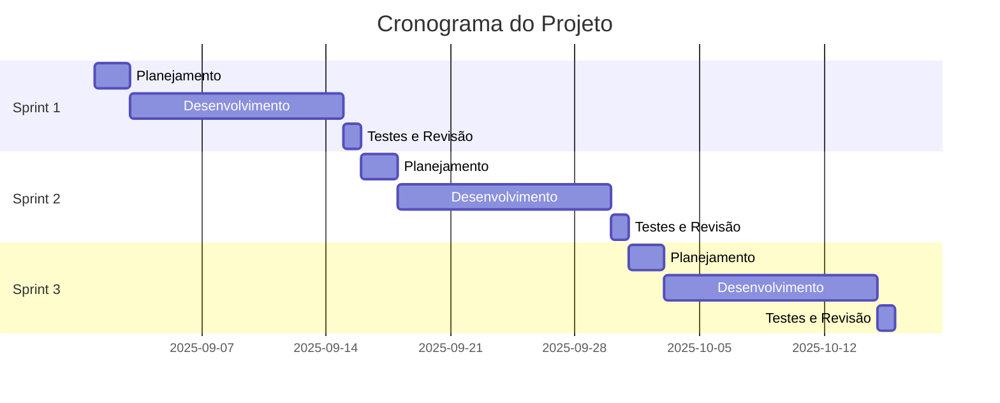

# [Backroom]

## 📑 Índice

| [Desafio](#descrição-do-desafio) | [Backlog](#backlog-do-produto)|[Cronograma](#cronograma-de-evolução-do-projeto) | [Sprints](#tabela-descritiva-das-sprints) | [Tecnologias](#tecnologias-utilizadas) | [Estrutura](#estrutura-do-projeto) | [Documentação](#link-para-documentação) | [Equipe](#equipe) |

## Descrição do Desafio

[Descreva aqui o problema ou desafio que o projeto pretende resolver. Explique o contexto, a necessidade identificada e os objetivos principais.]

## Backlog do Produto

- [ ] **Epic 1:** [Nome do Epic]
  - [ ] User Story 1.1: [Descrição]
  - [ ] User Story 1.2: [Descrição]
  - [ ] User Story 1.3: [Descrição]

- [ ] **Epic 2:** [Nome do Epic]
  - [ ] User Story 2.1: [Descrição]
  - [ ] User Story 2.2: [Descrição]

- [ ] **Epic 3:** [Nome do Epic]
  - [ ] User Story 3.1: [Descrição]
  - [ ] User Story 3.2: [Descrição]
  - [ ] User Story 3.3: [Descrição]

## Cronograma de Evolução do Projeto



## Tabela Descritiva das Sprints

| Sprint | Período | Objetivo | Status | Entregáveis |
|--------|---------|----------|--------|-------------|
| **Sprint 1** | 01/09 - 15/09 | [Objetivo principal da sprint] | 🟡 Em andamento | [Lista de entregáveis] |
| **Sprint 2** | 16/09 - 30/09 | [Objetivo principal da sprint] | ⚪ Planejada | [Lista de entregáveis] |
| **Sprint 3** | 01/10 - 15/10 | [Objetivo principal da sprint] | ⚪ Planejada | [Lista de entregáveis] |
| **Sprint 4** | 16/10 - 30/10 | [Objetivo principal da sprint] | ⚪ Planejada | [Lista de entregáveis] |

## Link para Documentação da Sprint

- [📋 Sprint 1 - Documentação](./docs/sprint-1/README.md)
- [📋 Sprint 2 - Documentação](./docs/sprint-2/README.md)
- [📋 Sprint 3 - Documentação](./docs/sprint-3/README.md)
- [📋 Sprint 4 - Documentação](./docs/sprint-4/README.md)

## Tecnologias Utilizadas

### Frontend
- [Framework/Biblioteca] - v[X.X.X]
- [Tecnologia 2] - v[X.X.X]

### Backend
- [Linguagem/Framework] - v[X.X.X]
- [Tecnologia 2] - v[X.X.X]

### Banco de Dados
- [Sistema de BD] - v[X.X.X]

### DevOps/Ferramentas
- [Ferramenta 1] - v[X.X.X]
- [Ferramenta 2] - v[X.X.X]

## Estrutura do Projeto

```
nome-do-projeto/
│
├── docs/                   # Documentação das sprints
│   ├── sprint-1/
│   ├── sprint-2/
│   └── sprint-3/
│
├── src/                    # Código fonte
│   ├── frontend/
│   ├── backend/
│   └── shared/
│
├── tests/                  # Testes automatizados
├── scripts/                # Scripts de build/deploy
├── config/                 # Arquivos de configuração
└── README.md              # Este arquivo
```

## Link para Documentação

📚 **Documentação Completa:** [Link para Wiki/Docs](./docs/README.md)

## Equipe

| Nome | Função | GitHub | LinkedIn |
|------|--------|--------|----------|
| [Nome 1] | Product Owner | [@usuario1](https://github.com/usuario1) | [LinkedIn](https://linkedin.com/in/perfil1) |
| [Nome 2] | Scrum Master | [@usuario2](https://github.com/usuario2) | [LinkedIn](https://linkedin.com/in/perfil2) |
| [Nome 3] | Tech Lead | [@usuario3](https://github.com/usuario3) | [LinkedIn](https://linkedin.com/in/perfil3) |
| [Nome 4] | Desenvolvedor Frontend | [@usuario4](https://github.com/usuario4) | [LinkedIn](https://linkedin.com/in/perfil4) |
| [Nome 5] | Desenvolvedor Backend | [@usuario5](https://github.com/usuario5) | [LinkedIn](https://linkedin.com/in/perfil5) |
