# Use Case Diagrams - Backroom System

This document contains all use case diagrams for the Backroom business management system using Mermaid syntax.

---

## 1. User Management Use Cases

```mermaid
graph TB
    subgraph "User Management System"
        UC1([User Registration])
        UC2([User Login])
        UC3([Password Reset])
        UC4([Update Profile])
        UC5([Enable 2FA])
        UC6([Manage Users])
        UC7([Assign Roles])
        UC8([View Audit Logs])
        UC9([Configure System])
    end
    
    User[👤 User]
    Admin[👤 Administrator]
    EmailService[📧 Email Service]
    AuthService[🔐 Auth Service]
    
    User --- UC1
    User --- UC2
    User --- UC3
    User --- UC4
    User --- UC5
    
    Admin --- UC6
    Admin --- UC7
    Admin --- UC8
    Admin --- UC9
    
    UC1 -.uses.-> EmailService
    UC2 -.uses.-> AuthService
    UC3 -.uses.-> EmailService
    UC5 -.uses.-> AuthService
    UC6 -.extends.-> UC7
    
    style UC1 fill:#e1f5ff
    style UC2 fill:#e1f5ff
    style UC3 fill:#e1f5ff
    style UC4 fill:#e1f5ff
    style UC5 fill:#e1f5ff
    style UC6 fill:#ffe1e1
    style UC7 fill:#ffe1e1
    style UC8 fill:#ffe1e1
    style UC9 fill:#ffe1e1
```

### Actors
- **User**: Regular system user (Employee, Manager)
- **Administrator**: System administrator with full access
- **Email Service**: External email system for notifications
- **Auth Service**: Authentication service provider

### Use Cases
1. **User Registration**: New user creates account
2. **User Login**: User authenticates into system
3. **Password Reset**: User resets forgotten password
4. **Update Profile**: User updates personal information
5. **Enable 2FA**: User activates two-factor authentication
6. **Manage Users**: Admin views and manages user accounts
7. **Assign Roles**: Admin assigns roles to users
8. **View Audit Logs**: Admin reviews system activity logs
9. **Configure System**: Admin configures system settings

---

## 2. Project Management Use Cases

```mermaid
graph TB
    subgraph "Project Management System"
        UC10([Create Project])
        UC11([Edit Project])
        UC12([Delete Project])
        UC13([Assign Team Members])
        UC14([Set Milestones])
        UC15([Track Budget])
        UC16([Archive Project])
        UC17([View Project Dashboard])
        UC18([Generate Reports])
    end
    
    Manager[👤 Manager]
    Employee[👤 Employee]
    Client[👤 Client]
    NotificationSvc[📬 Notification Service]
    
    Manager --- UC10
    Manager --- UC11
    Manager --- UC12
    Manager --- UC13
    Manager --- UC14
    Manager --- UC15
    Manager --- UC16
    Manager --- UC17
    Manager --- UC18
    
    Employee --- UC17
    Client --- UC17
    
    UC10 -.includes.-> UC13
    UC10 -.includes.-> UC14
    UC13 -.uses.-> NotificationSvc
    UC17 -.includes.-> UC15
    
    style UC10 fill:#e1ffe1
    style UC11 fill:#e1ffe1
    style UC12 fill:#e1ffe1
    style UC13 fill:#e1ffe1
    style UC14 fill:#e1ffe1
    style UC15 fill:#fff9e1
    style UC16 fill:#fff9e1
    style UC17 fill:#e1f5ff
    style UC18 fill:#fff9e1
```

### Actors
- **Manager**: Project manager with full project control
- **Employee**: Team member with view access
- **Client**: External client with limited view access
- **Notification Service**: System for sending notifications

### Use Cases
10. **Create Project**: Manager creates new project
11. **Edit Project**: Manager modifies project details
12. **Delete Project**: Manager removes project
13. **Assign Team Members**: Manager assigns team to project
14. **Set Milestones**: Manager defines project milestones
15. **Track Budget**: Monitor project budget and spending
16. **Archive Project**: Move completed project to archive
17. **View Project Dashboard**: View project status and metrics
18. **Generate Reports**: Create project performance reports

---

## 3. Task Management Use Cases

```mermaid
graph TB
    subgraph "Task Management System"
        UC19([Create Task])
        UC20([Assign Task])
        UC21([Update Task Status])
        UC22([Add Comments])
        UC23([Log Time])
        UC24([Attach Files])
        UC25([Set Dependencies])
        UC26([View Kanban Board])
        UC27([Filter Tasks])
        UC28([Mark as Blocked])
    end
    
    Manager[👤 Manager]
    Employee[👤 Employee]
    NotificationSvc[📬 Notification Service]
    FileStorage[💾 File Storage]
    
    Manager --- UC19
    Manager --- UC20
    Manager --- UC25
    
    Employee --- UC21
    Employee --- UC22
    Employee --- UC23
    Employee --- UC24
    Employee --- UC26
    Employee --- UC27
    Employee --- UC28
    
    Manager --- UC26
    Manager --- UC27
    
    UC20 -.uses.-> NotificationSvc
    UC21 -.uses.-> NotificationSvc
    UC22 -.uses.-> NotificationSvc
    UC24 -.uses.-> FileStorage
    UC26 -.includes.-> UC27
    UC28 -.uses.-> NotificationSvc
    
    style UC19 fill:#e1ffe1
    style UC20 fill:#e1ffe1
    style UC21 fill:#e1f5ff
    style UC22 fill:#e1f5ff
    style UC23 fill:#e1f5ff
    style UC24 fill:#e1f5ff
    style UC25 fill:#fff9e1
    style UC26 fill:#e1f5ff
    style UC27 fill:#e1f5ff
    style UC28 fill:#ffe1e1
```

### Actors
- **Manager**: Creates and assigns tasks
- **Employee**: Executes and updates tasks
- **Notification Service**: Sends task notifications
- **File Storage**: Stores task attachments

### Use Cases
19. **Create Task**: Manager creates new task
20. **Assign Task**: Manager assigns task to employee
21. **Update Task Status**: Employee changes task status
22. **Add Comments**: Add discussion comments to task
23. **Log Time**: Employee logs time spent on task
24. **Attach Files**: Upload files related to task
25. **Set Dependencies**: Define task dependencies
26. **View Kanban Board**: Visual task board view
27. **Filter Tasks**: Filter tasks by criteria
28. **Mark as Blocked**: Indicate task is blocked

---

## 4. Communication and Collaboration Use Cases

```mermaid
graph TB
    subgraph "Communication System"
        UC29([Send Message])
        UC30([Create Thread])
        UC31([Mention User])
        UC32([Share Files])
        UC33([Schedule Meeting])
        UC34([Create Agenda])
        UC35([Record Minutes])
        UC36([Receive Notifications])
        UC37([Set Preferences])
    end
    
    User[👤 User]
    Manager[👤 Manager]
    NotificationSvc[📬 Notification Service]
    Calendar[📅 Calendar Service]
    FileStorage[💾 File Storage]
    
    User --- UC29
    User --- UC30
    User --- UC31
    User --- UC32
    User --- UC36
    User --- UC37
    
    Manager --- UC33
    Manager --- UC34
    Manager --- UC35
    
    UC29 -.uses.-> NotificationSvc
    UC31 -.uses.-> NotificationSvc
    UC32 -.uses.-> FileStorage
    UC33 -.uses.-> Calendar
    UC33 -.uses.-> NotificationSvc
    UC36 -.includes.-> UC37
    
    style UC29 fill:#e1f5ff
    style UC30 fill:#e1f5ff
    style UC31 fill:#e1f5ff
    style UC32 fill:#e1f5ff
    style UC33 fill:#e1ffe1
    style UC34 fill:#e1ffe1
    style UC35 fill:#e1ffe1
    style UC36 fill:#fff9e1
    style UC37 fill:#fff9e1
```

### Actors
- **User**: All system users
- **Manager**: Meeting organizers
- **Notification Service**: Sends real-time notifications
- **Calendar Service**: External calendar integration
- **File Storage**: Stores shared files

### Use Cases
29. **Send Message**: Send message to team members
30. **Create Thread**: Start discussion thread
31. **Mention User**: @mention user in message
32. **Share Files**: Share files in chat
33. **Schedule Meeting**: Create meeting invitation
34. **Create Agenda**: Define meeting agenda
35. **Record Minutes**: Document meeting minutes
36. **Receive Notifications**: Get system notifications
37. **Set Preferences**: Configure notification preferences

---

## 5. Document Management Use Cases

```mermaid
graph TB
    subgraph "Document Management System"
        UC38([Upload Document])
        UC39([Organize Folders])
        UC40([Search Documents])
        UC41([Version Control])
        UC42([Share Document])
        UC43([Download Document])
        UC44([Set Permissions])
        UC45([Tag Documents])
    end
    
    User[👤 User]
    Manager[👤 Manager]
    FileStorage[💾 File Storage]
    SearchEngine[🔍 Search Service]
    
    User --- UC38
    User --- UC39
    User --- UC40
    User --- UC43
    User --- UC45
    
    Manager --- UC42
    Manager --- UC44
    
    UC38 -.uses.-> FileStorage
    UC40 -.uses.-> SearchEngine
    UC41 -.uses.-> FileStorage
    UC42 -.extends.-> UC44
    UC43 -.uses.-> FileStorage
    
    style UC38 fill:#e1f5ff
    style UC39 fill:#e1f5ff
    style UC40 fill:#e1f5ff
    style UC41 fill:#fff9e1
    style UC42 fill:#e1ffe1
    style UC43 fill:#e1f5ff
    style UC44 fill:#e1ffe1
    style UC45 fill:#e1f5ff
```

### Actors
- **User**: Regular users managing documents
- **Manager**: Controls document permissions
- **File Storage**: Cloud storage system
- **Search Service**: Document search engine

### Use Cases
38. **Upload Document**: Upload files to system
39. **Organize Folders**: Create folder structure
40. **Search Documents**: Find documents by criteria
41. **Version Control**: Manage document versions
42. **Share Document**: Share document with team
43. **Download Document**: Download document locally
44. **Set Permissions**: Control document access
45. **Tag Documents**: Add metadata tags

---

## 6. Resource Management Use Cases

### Actors
- **Manager**: Manages team resources
- **Administrator**: Manages physical assets
- **Reporting Service**: Generates resource reports

### Use Cases
46. **View Availability**: Check resource availability
47. **Allocate Resources**: Assign resources to projects
48. **Track Utilization**: Monitor resource usage
49. **Identify Overallocation**: Find resource conflicts
50. **Generate Reports**: Create utilization reports
51. **Manage Equipment**: Track equipment inventory
52. **Schedule Maintenance**: Plan equipment maintenance

---

## 7. Reporting and Analytics Use Cases

```mermaid
graph TB
    subgraph "Reporting and Analytics System"
        UC53([View Dashboard])
        UC54([Track KPIs])
        UC55([Generate Project Reports])
        UC56([Export Reports])
        UC57([Track Time])
        UC58([View Gantt Chart])
        UC59([Analyze Metrics])
        UC60([Custom Reports])
    end
    
    Manager[👤 Manager]
    Admin[👤 Administrator]
    Employee[👤 Employee]
    ReportingSvc[📊 Reporting Service]
    AnalyticsSvc[📈 Analytics Service]
    
    Manager --- UC53
    Manager --- UC54
    Manager --- UC55
    Manager --- UC56
    Manager --- UC58
    Manager --- UC59
    
    Admin --- UC60
    
    Employee --- UC57
    
    UC53 -.includes.-> UC54
    UC55 -.uses.-> ReportingSvc
    UC56 -.uses.-> ReportingSvc
    UC59 -.uses.-> AnalyticsSvc
    UC60 -.uses.-> ReportingSvc
    
    style UC53 fill:#e1f5ff
    style UC54 fill:#fff9e1
    style UC55 fill:#e1ffe1
    style UC56 fill:#e1ffe1
    style UC57 fill:#e1f5ff
    style UC58 fill:#e1f5ff
    style UC59 fill:#fff9e1
    style UC60 fill:#ffe1e1
```

### Actors
- **Manager**: Views reports and analytics
- **Administrator**: Creates custom reports
- **Employee**: Tracks personal time
- **Reporting Service**: Generates reports
- **Analytics Service**: Processes analytics data

### Use Cases
53. **View Dashboard**: View analytics dashboard
54. **Track KPIs**: Monitor key performance indicators
55. **Generate Project Reports**: Create project reports
56. **Export Reports**: Export to PDF/Excel
57. **Track Time**: Log time spent on work
58. **View Gantt Chart**: Visual project timeline
59. **Analyze Metrics**: Deep dive into metrics
60. **Custom Reports**: Build custom report templates

---

## 8. Client Portal Use Cases

```mermaid
graph TB
    subgraph "Client Portal System"
        UC61([View Projects])
        UC62([View Milestones])
        UC63([Access Documents])
        UC64([Submit Feedback])
        UC65([Approve Deliverables])
        UC66([Request Changes])
        UC67([Rate Service])
        UC68([View History])
    end
    
    Client[👤 Client]
    Manager[👤 Manager]
    NotificationSvc[📬 Notification Service]
    FileStorage[💾 File Storage]
    
    Client --- UC61
    Client --- UC62
    Client --- UC63
    Client --- UC64
    Client --- UC65
    Client --- UC66
    Client --- UC67
    Client --- UC68
    
    Manager --- UC68
    
    UC61 -.includes.-> UC62
    UC63 -.uses.-> FileStorage
    UC64 -.uses.-> NotificationSvc
    UC65 -.uses.-> NotificationSvc
    UC66 -.uses.-> NotificationSvc
    
    style UC61 fill:#e1f5ff
    style UC62 fill:#e1f5ff
    style UC63 fill:#e1f5ff
    style UC64 fill:#fff9e1
    style UC65 fill:#e1ffe1
    style UC66 fill:#ffe1e1
    style UC67 fill:#fff9e1
    style UC68 fill:#e1f5ff
```

### Actors
- **Client**: External client user
- **Manager**: Manages client interactions
- **Notification Service**: Sends feedback notifications
- **File Storage**: Stores project documents

### Use Cases
61. **View Projects**: Client views assigned projects
62. **View Milestones**: Check project milestones
63. **Access Documents**: Download project documents
64. **Submit Feedback**: Provide project feedback
65. **Approve Deliverables**: Approve completed work
66. **Request Changes**: Request modifications
67. **Rate Service**: Rate service quality
68. **View History**: View communication history

---

## Use Case Relationships

### Legend
- **Solid line (—)**: Association between actor and use case
- **Dotted line with "includes" (-.includes.->)**: One use case includes another
- **Dotted line with "extends" (-.extends.->)**: One use case extends another
- **Dotted line with "uses" (-.uses.->)**: Use case uses external system

### Color Code
- 🔵 Blue (#e1f5ff): General user actions
- 🟢 Green (#e1ffe1): Manager/Admin actions
- 🟡 Yellow (#fff9e1): System/Service actions
- 🔴 Red (#ffe1e1): Critical/Important actions

---

**Document Version**: 1.0  
**Last Updated**: October 2025  
**Created By**: Project Team